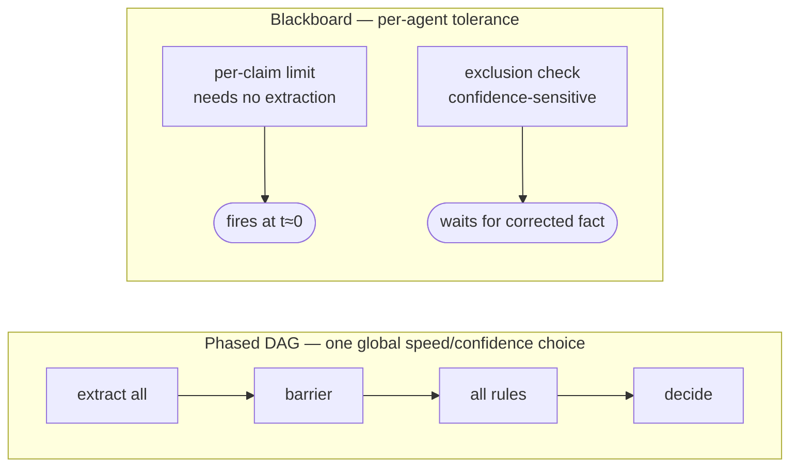
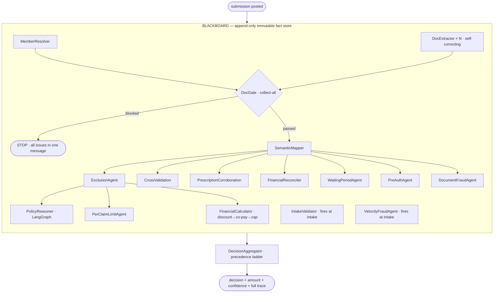

# Architecture Document — Claims Adjudication

*AI-native OPD claims adjudication engine. This document explains the system that was
built: what the components are, how they interact, why it was designed this way (and the
alternatives weighed), and how it scales to 10× load. It is the deep-dive companion to the
[README](README.md): the README **pitches** the design; this document **specifies** it.
Section names below deliberately mirror the README's so the two read as one story.*

---

## 1. What the system does

Given one OPD claim — a member id, a category, an amount, and a set of uploaded
documents — the system produces a single adjudication decision:

```
APPROVED · PARTIAL · REJECTED · MANUAL_REVIEW · BLOCKED · PROCESSING_ERROR
```

…plus an approved amount where applicable, a confidence score, member-facing
messages, and a **complete replayable trace** of every check that ran.

Adjudicating a claim is not one judgment. It is six, made together:

1. **Identity** — who is the member, and which dependents are covered?
2. **Document integrity** — are the right documents present, readable, and for the same person?
3. **Coverage** — does the policy cover this condition / these line items?
4. **Money** — what is the payable amount after exclusions, discount, co-pay, and caps?
5. **Fraud** — are there velocity or document-anomaly signals?
6. **Confidence** — how sure are we, and should a human look?

The central design decision is that each of these is an **independent agent on a shared
blackboard**, not a stage in a hand-wired pipeline.

---

## 2. The core idea — a blackboard, not a pipeline

*This is the full version of the README section **"The Core Idea — a Blackboard, not a
Pipeline."** Same argument, same `PerClaimLimitAgent`-vs-`ExclusionAgent` example — here
with the mechanism spelled out end to end.*

### 2.1 The conventional approach and why it is wrong here

The obvious design is a **DAG** (or a single LangGraph) that fixes execution order:
extract all documents → validate → check coverage → compute money → decide. Every new
check means editing the graph, and a *phased* DAG forces **one global speed-vs-confidence
choice per claim**: it waits at a barrier for *all* extraction to finish before *any* rule
runs.

But the checks do not need the same inputs:

- `PerClaimLimitAgent` needs **zero** document confidence — ₹7,500 > ₹5,000 is true the
  moment the claim arrives.
- `ExclusionAgent` is **confidence-sensitive** — it must wait for high-confidence
  extracted text or it excludes the wrong line.

A single barrier cannot serve both. A blackboard lets each agent set its **own** tolerance.

### 2.2 What a blackboard actually is

Picture a room full of specialists and one shared whiteboard. Nobody talks to anybody. A
specialist just **watches the whiteboard**, and the moment the information they need appears
on it, they do their bit of work and **write their answer back on the board** for everyone
else to see. That's the whole idea. The "blackboard" is that shared whiteboard; the
specialists are the **agents**; the notes on the board are **facts**.

Concretely, the system has exactly three moving parts.

**1. A fact** is one note on the board — a single labelled piece of information. It is a
plain immutable record (`blackboard/core.py`): a `key` (its label), a `value` (the data),
the `author` that wrote it, and a `seq` number stamped in the order it was posted. For
example, after the bill is read, the board holds a fact like:

```
key   = "extraction.F008"
value = { doc_type: "HOSPITAL_BILL", total: 1500, line_items: [...], readable: true }
author= "extractor.F008"
seq   = 4
```

Facts are **append-only and never edited** — once a note is on the board, it stays exactly
as written. (That single rule is what later makes the whole run replayable and auditable.)

**2. An agent** is one specialist. It declares two things and nothing more: the fact labels
it needs (`reads`) and the one fact label it will produce (`writes`). It contains no
knowledge of *when* it runs or *who* runs before it. For instance, the per-claim-limit
check is literally:

```python
class PerClaimLimitAgent(...):
    reads  = ["coverage"]          # "I need the 'coverage' fact on the board"
    writes = "verdict.perclaim"    # "I will post a 'verdict.perclaim' fact"
```

An agent never calls another agent. It only reads notes and writes a note.

**3. The scheduler** is the rule that connects them. On every tick it looks at each agent
that hasn't run yet and asks one question: *are all the facts you `read` already on the
board?* If yes, it runs that agent now (and several at once, if several are ready). When an
agent finishes, its new fact goes on the board — which may be the missing input some *other*
agent was waiting for, so that one now becomes runnable. The board fills up in a ripple
until no agent has anything left to do.

So the chain `submission → coverage → verdict.perclaim` is never written down anywhere as a
sequence. It happens because `ExclusionAgent` posts `coverage`, and the existence of
`coverage` is exactly what makes `PerClaimLimitAgent` eligible to run. **The order is a
consequence of who-needs-what, not an instruction anyone wrote.**

That is the one sentence to take away: in a pipeline you write the order; on a blackboard
you write the dependencies and the order *emerges*. The practical payoff — and why that
emergence matters here rather than being a gimmick — is §2.4.

### 2.3 B-static

The engine is **B-static**: each agent fires **at most once**. Adjudication is a single-shot
decision (unlike, say, a planning agent that re-plans), so firing once keeps the trace
linear and fully replayable. Every fact carries a monotonic `seq` and a `derived_from`
lineage tuple, populated automatically from the posting agent's `reads`.



### 2.4 The decision I'm proudest of

If I had to defend one decision in this whole system, it's this one — choosing a blackboard
over the pipeline that everyone reaches for first.

Almost every claims engine you'll see is a **pipeline**: extract → validate → price →
decide, wired in that order by hand. It works, and it's the obvious thing to build. But it
quietly bakes in a lie — that *every* check needs the *same* inputs at the *same* time. It
doesn't. Checking that ₹7,500 exceeds a ₹5,000 per-claim limit needs **nothing** but the
claim amount; it's true the millisecond the claim lands. Deciding whether a "diabetes"
keyword is a real exclusion needs the **fully self-corrected, high-confidence** extraction,
or it rejects the wrong line. A pipeline forces both of those behind one barrier and makes
the cheap, certain check wait for the expensive, uncertain one. **The same claim is made to
run at one speed when it actually has two.**

The blackboard dissolves that. Each agent declares only the facts it reads, and the
scheduler fires it the instant those facts exist — so the per-claim-limit check answers at
`t≈0` while the exclusion check waits exactly as long as it needs to, on the *same* claim,
*without me coordinating any of it*. I never wrote "run A before B." I wrote down what each
check depends on, and the execution order **fell out of the data**. The dependency graph
isn't drawn anywhere in the codebase — it's implied by sixteen `reads` lists and discovered
fresh on every run.

What makes me proud isn't the cleverness — it's what the choice *bought*, for free, that I'd
otherwise have had to engineer:

- **Adding a check is one class, not a graph edit.** Drop in an agent with its `reads` and
  `writes`, and it self-inserts at exactly the right moment because its data dependencies
  *are* its schedule. The day a new policy rule arrives, nobody has to find the right slot
  in a pipeline and re-test the ordering.
- **Parallelism with zero concurrency code.** Independent agents are independent `asyncio`
  tasks the moment they're ready. The N document extractors overlap automatically; I never
  wrote a thread pool or a `gather`.
- **The audit log is a side effect, not a feature I built.** Because the board is
  append-only and immutable and every fact carries a `seq` and a `derived_from` lineage,
  the trace *is* the explanation. An adjudicator can replay exactly what each agent saw and
  concluded — and even the checks that were *skipped* are on the board, with a reason. In a
  domain where you must defend every rejection, that's not a nice-to-have; it's the product.
- **Failure is contained, not catastrophic.** A crashing agent posts a `degraded` fact
  instead of taking down the run, the pipeline continues on what it has, and confidence
  drops to reflect the missing evidence (TC011). I didn't add a resilience layer — the
  substrate is resilient by construction.

The honest test of a design decision is whether the *next* requirement makes you regret it.
Here, every "what about…" — a new rule, a new document type, cross-process scaling, an
explainability demand — is a single agent or a change of where the board is stored, never a
rewrite of the control flow. That's why the blackboard is the part of this system I'd put my
name on. It turned "orchestrate a claim" from something I choreograph into something the
data decides.

---

## 3. Component map

The system is five layers. Each is independently testable; the blackboard is the only
contract between the engine core and the agents.

```
┌──────────────────────────────────────────────────────────────────────────┐
│ FRONTEND  Next.js 14 · TypeScript · SSE consumer                           │
│   DemoView · CustomView · EvalView · ResultPanel · live fact stream        │
└──────────────────────────────────────────────────────────────────────────┘
                                  │ HTTP + SSE
┌──────────────────────────────────────────────────────────────────────────┐
│ API  FastAPI                                                               │
│   POST /claims (202, background task)   GET /claims/{id}   /{id}/stream     │
│   ClaimStore (in-memory · Redis · Postgres)   never returns a raw 5xx      │
└──────────────────────────────────────────────────────────────────────────┘
                                  │ run_claim()
┌──────────────────────────────────────────────────────────────────────────┐
│ ENGINE                                                                     │
│   engine.py        build_agents() + run_claim()                            │
│   scheduler.py     adjudicate() — the ~50-line fire-when-ready core         │
│   blackboard/core  Fact · Blackboard · Agent · GateGatedAgent              │
│   aggregator.py    reduce quiescent board → Decision (precedence ladder)   │
└──────────────────────────────────────────────────────────────────────────┘
                                  │ reads/writes facts
┌──────────────────────────────────────────────────────────────────────────┐
│ AGENTS  (one class = one fact)                                             │
│   intake · member_resolver · doc_gate · semantic_mapper                    │
│   exclusion · per_claim_limit · waiting_period · pre_auth                  │
│   financial_reconciler · financial_calculator                              │
│   velocity_fraud · document_fraud · cross_validation                       │
│   prescription_corroboration · policy_reasoner (LangGraph)                 │
│   extractor.{file_id} × N                                                  │
└──────────────────────────────────────────────────────────────────────────┘
                                  │
┌──────────────────────────────────────────────────────────────────────────┐
│ EXTERNAL                                                                   │
│   LLM: Claude Haiku 4.5 (primary) · Gemini 2.5 Flash (fallback) · Fake      │
│   Policy: policy_terms.json (all thresholds — never hardcoded)             │
│   Data: Supabase (roster + docs, UI only) · optional Redis (SSE bus)       │
└──────────────────────────────────────────────────────────────────────────┘
```

Component interfaces are specified precisely in **COMPONENT_CONTRACTS.md**.

---

## 4. End-to-end data flow



Walking one clean claim (TC004) through the board, in the order the facts were actually
posted (from the eval trace):

1. `submission` is posted as fact #0 — the seed.
2. `IntakeValidator`, `VelocityFraudAgent`, `MemberResolver`, and one `DocExtractor` per
   document all have `reads = ["submission"]`, so they fire **immediately and
   concurrently** (facts #1–#5).
3. `DocGate` overrides `ready()` to wait until the member is resolved **and** every
   `extraction.{id}` exists. It then runs all three checks (readability, required types,
   patient match) and posts a single `gate` fact (#6).
4. Because the gate did not block, the gate-gated agents unblock: `SemanticMapper` posts
   `semantic` (#8), which in turn unblocks `ExclusionAgent`, `CrossValidation`,
   `FinancialReconciler`, etc.
5. `ExclusionAgent` posts `coverage`, unblocking `PerClaimLimitAgent`,
   `FinancialCalculator`, and `PolicyReasoner`.
6. When the board reaches **quiescence** (nothing running, nothing newly ready), the
   scheduler returns and `DecisionAggregator` reduces the complete fact-set to one
   `Decision`.

Note from the trace: the *numeric order* of facts #1–#5 differs run-to-run because they
race — but the *decision* is deterministic, because the aggregator reads the complete set,
never a partial one.

---

## 5. The scheduler (the ~50-line core)

`scheduler.adjudicate()` has no concept of a phase or a barrier. The loop:

```
post the submission fact
while pending or running:
    for each pending agent:
        state = agent.ready(bb)          # READY | WAIT | SKIP
        SKIP  → post skipped.<name> with a reason, drop it
        READY → launch agent.run(bb) as an asyncio task, drop from pending
    if nothing running: break            # quiescent
    await FIRST_COMPLETED (bounded by the wall-clock deadline)
    post each finished result            # may unblock the next agents
return the board
```

Three properties fall out of this:

- **Implicit parallelism.** Ready agents run as concurrent `asyncio` tasks. No
  hand-written concurrency choreography — independent extractions overlap automatically.
- **Provable skipping.** An agent that can prove it is unneeded returns `SKIP`; the
  scheduler posts a `skipped.<name>` fact with a reason (`PROVABLY_PASS`, `GATE_BLOCKED`,
  `TIMEOUT`). Skipped agents are **visible in the trace**, never silently absent — the
  audit log is always complete. (In the TC001 trace, 11 downstream agents appear as
  `skipped.* reason=GATE_BLOCKED`.)
- **Graceful degradation via a deadline.** A wall-clock deadline drains any straggler as a
  `degraded` fact and cancels its task, so a hung component cannot wedge the pipeline.

`Agent.run()` is the safe entry point: it wraps `_run()` in a try/except and, on **any**
exception, returns a `degraded` fact instead of raising. A component failure is therefore
*recorded*, not fatal — which is exactly what TC011 tests.

---

## 6. Decision aggregation — a precedence ladder

The aggregator runs **after** quiescence, not as a board agent, so it always sees the
complete fact-set. It walks a fixed precedence ladder (`aggregator.py`):

```
0. extraction.system_error?            → PROCESSING_ERROR   (service failed; cannot adjudicate)
1. gate.blocked?                       → BLOCKED            (document problem)
2. any verdict REJECTED / whole-claim excluded → REJECTED   (ranked reason, see below)
   intake hard-fail                    → REJECTED
3. any verdict MANUAL_REVIEW / flag.ambiguity → MANUAL_REVIEW
4. all covered lines excluded          → REJECTED
5. some excluded + ≥1 covered          → PARTIAL
6. otherwise                           → APPROVED
```

When several rejection reasons apply, they are ranked — this is decision *logic*, not
policy data, so the ranks live in code, never in `policy_terms.json`:

```
EXCLUDED_CONDITION (4) > WAITING_PERIOD (3) > PRE_AUTH_MISSING (2) > PER_CLAIM_EXCEEDED (1)
```

So a bariatric claim that also exceeds the per-claim limit is reported as `EXCLUDED`, the
more fundamental reason (TC012).

**Why precedence-as-code, not a learned model:** an insurer must be able to explain *why*
a claim was rejected and defend that ordering. A ranked ladder is auditable and stable; a
classifier is neither.

### 6.1 Confidence model

Confidence is computed from real signals, not a guess (`aggregator._confidence`):

```
confidence = 0.95 × min(avg_extraction_quality, avg_rule_certainty)
           − 0.25 × (number of degraded components)
```

All arithmetic is `decimal.Decimal`, clamped to `[0, 1]`. The `min()` is deliberate: the
decision is only as trustworthy as its *weakest* link — a perfect rule pass over a blurry
document should not read as high-confidence.

| Scenario | Confidence | Seen in |
|---|---|---|
| Clean approval, all docs clear | 0.95 | TC004, TC010 |
| One degraded component | 0.70 | TC011 (0.95 − 0.25) |
| Multiple issues | < 0.60 → MANUAL_REVIEW threshold | — |

The 0.95 base, 0.25 penalty, and 0.60 review threshold are **calibrated heuristics** tuned
against the 12 cases, not learned. This is stated honestly as an assumption.

---

## 7. Key design decisions

*These four expand the README's **"Key Design Decisions"** (LangGraph scope, forced-tool-use
extraction, the load-bearing financial waterfall) and **"Catching Document Problems Early"**
(the collect-all gate). The alternatives weighed against each — a single LangGraph flow, a
phased DAG, an LLM-as-decider, hardcoded thresholds — are argued inline in §2.1 and here,
rather than in a separate table.*

### 7.1 LangGraph only where iterative reasoning earns its place

A blackboard is the wrong tool for the one genuinely fuzzy sub-problem: *is a diagnosis
truly excluded, or did a keyword merely match?* A hit on "diabetes" might be an incidental
comorbidity, not a pre-existing-condition claim. That needs multi-step, tool-using,
conditional reasoning — exactly what LangGraph's StateGraph provides.

`PolicyReasonerAgent` runs a StateGraph with nodes `load_context → identify_ambiguity →
verify_exclusions` (≤3 passes; the LLM calls `verify_exclusion` + `lookup_policy_clause`
tools) `→ {confirm | override | escalate}`. The keyword verdict is posted **immediately**
(a `preliminary_decision` fact) so the client sees a fast answer, while the graph reasons in
the background and either confirms it, **overrides** it (posting `coverage.revised` for
downstream agents), or **escalates** to `MANUAL_REVIEW` after three inconclusive passes.

The heavy tool is scoped to exactly **one node** of the system. Everywhere else,
deterministic code decides.

### 7.2 Forced-tool-use extraction with a hallucination guard

Documents are messy — handwriting, stamps over text, phone photos — and free-text LLM
parsing degrades *silently*. The model is given a `record_extraction` tool it **must** call:
it returns a valid typed `ExtractionResult` or nothing, and "nothing" becomes `UNREADABLE`,
never a hallucinated number flowing into the payout math. A multi-pass guard re-reads
low-confidence documents and cross-checks totals; divergence marks the document unreadable.

The LLM layer is an **interface, not a vendor**: `LLMClient` is a `Protocol`. Claude Haiku
4.5 is primary, Gemini 2.5 Flash is a drop-in fallback, and a deterministic
`FakeLLMClient` runs the entire test suite with **zero API calls** — which is why the eval
is reproducible and free.

### 7.3 Order is load-bearing in the financial waterfall

TC010 encodes a real trap: the network discount must be applied **before** co-pay, not
after — the two orders produce different payouts. `FinancialCalculator` enforces one
explicit sequence — `gross → − network discount → − co-pay → category cap` — and records
every step in a human-readable `note`. The consultation-fee line is capped at its per-line
sub-limit before the waterfall. All money math is `Decimal`; no LLM ever touches it.
*"LLM proposes, deterministic code decides."*

### 7.4 The DocGate is collect-all

A naive system rejects on the **first** document problem it hits, forcing N round-trips.
`DocGate` runs every check across every document and reports **all** problems in one
consolidated `gate` fact (TC003's trace shows two issues surfaced at once: an unreadable
bill *and* a patient-name mismatch). The member fixes everything in one pass. The message
always names the specific document type / patient names found — never a generic error,
which is explicitly graded by the eval.

---

## 8. Limitations of the current design

*Sections 8–9 are the detailed version of the README's **"Limitations & the Path to 10×."***

These are demo shortcuts, stated honestly — none is baked into the agent contracts.

- **In-memory claim store, single worker.** `ClaimStore` defaults to a per-process dict;
  the SSE fallback is an `asyncio.Queue`, which is single-process.
- **Velocity ledger is per-process** (in the live custom flow) — fine for a demo, not for
  horizontal workers.
- **Multi-document PDFs use one-pass LLM segmentation** rather than a robust `pypdf` split.
- **No API authentication** and a single corporate policy (no multi-tenant resolution).
- **Fraud detection is signal-based, not forensic** — velocity and arithmetic anomalies,
  not pixel-level image-tamper detection.
- **Confidence cut-offs are calibrated, not learned** (§6.1).

---

## 9. Path to 10× load

The reason these are *configuration* changes, not rewrites: in the architecture, **state
location and worker count are orthogonal to the agent contracts**. An agent reads and
writes facts; it does not care whether the board is backed by memory, Redis, or Postgres.

| Today | At 10× |
|---|---|
| In-memory claim store (per-process) | Redis + Postgres persistence — `ClaimStore` already accepts both via constructor injection; `main.py` wires them when `DATABASE_URL` / `REDIS_URL` are set. |
| Single uvicorn worker | Horizontal workers behind the Redis-backed store and SSE pub/sub bus (already implemented as the non-default path). |
| Velocity ledger per-process | Redis `INCR` with TTL — atomic and cross-process. |
| One-pass PDF segmentation | `pypdf` split + a guarded `extract()` per segment, fanned out as N concurrent `DocExtractor`s (the board already handles N extractors). |
| No auth, single policy | JWT middleware + per-tenant policy resolution — `_resolve_policy()` already accepts a caller-supplied policy per request. |

Throughput scales because the scheduler is `asyncio`-concurrent within a claim and claims
are independent across workers. The bottleneck at scale is LLM extraction latency/cost,
addressed by (a) the offline content-lift path for structured submissions, (b) per-document
caching keyed by content hash, and (c) the cheaper-model fallback already in place.

---

## Appendix — agent roster

Order is **not** declared; it emerges from each agent's `reads`. The grouping reflects only
*when* each agent becomes eligible.

| Agent | Reads | Writes | Responsibility |
|---|---|---|---|
| `MemberResolver` | submission | member | Resolve identity + dependents against the roster |
| `IntakeValidator` | submission | verdict.intake | Minimum-amount / field validation (fires at intake) |
| `VelocityFraudAgent` | submission | verdict.fraud | Same-day / monthly / high-value signals (fires at intake) |
| `DocExtractor × N` | submission | extraction.{id} | LLM vision extraction, one per document |
| `DocGate` | submission, member, extraction.* | gate | Collect-all document verification; blocks early |
| `SemanticMapper` | submission | semantic | Unify extracted line items into one claim view |
| `CrossValidation` | semantic | verdict.consistency | Claimed amount vs bill total, date consistency |
| `PrescriptionCorroboration` | semantic | verdict.prescription | Billed medicines vs prescription |
| `ExclusionAgent` | semantic | coverage | Whole-claim + line-item exclusions |
| `FinancialReconciler` | semantic | financial_facts | Σ(line items) vs stated total + divergence |
| `WaitingPeriodAgent` | submission, member | verdict.waiting | Condition-specific waiting periods |
| `PreAuthAgent` | submission | verdict.preauth | Pre-auth enforcement for high-value tests |
| `DocumentFraudAgent` | submission | verdict.docfraud | Anomaly signals; injectable failure hook |
| `PerClaimLimitAgent` | coverage | verdict.perclaim | Category-aware per-claim ceiling |
| `PolicyReasonerAgent` | coverage | policy_reasoning (+ coverage.revised / flag.ambiguity) | LangGraph reasoning over the exclusion verdict |
| `FinancialCalculator` | coverage, financial_facts, submission | financial_breakdown | Final payout waterfall |
