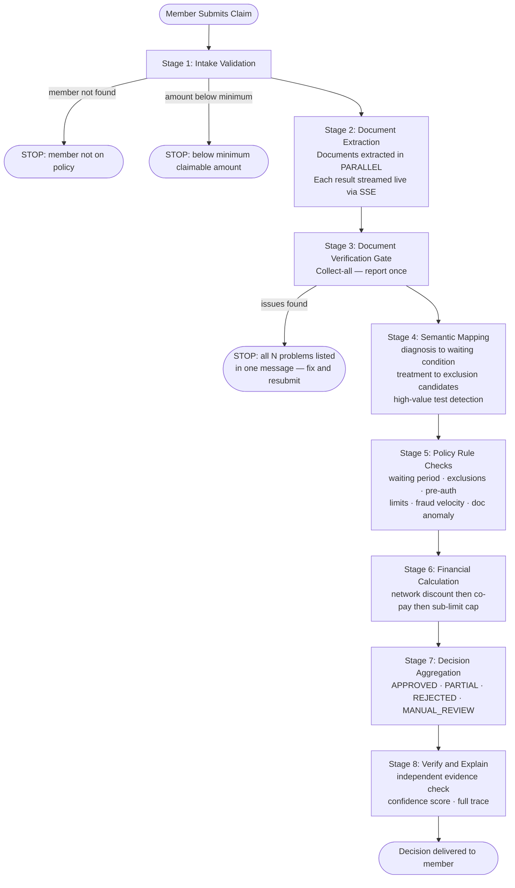
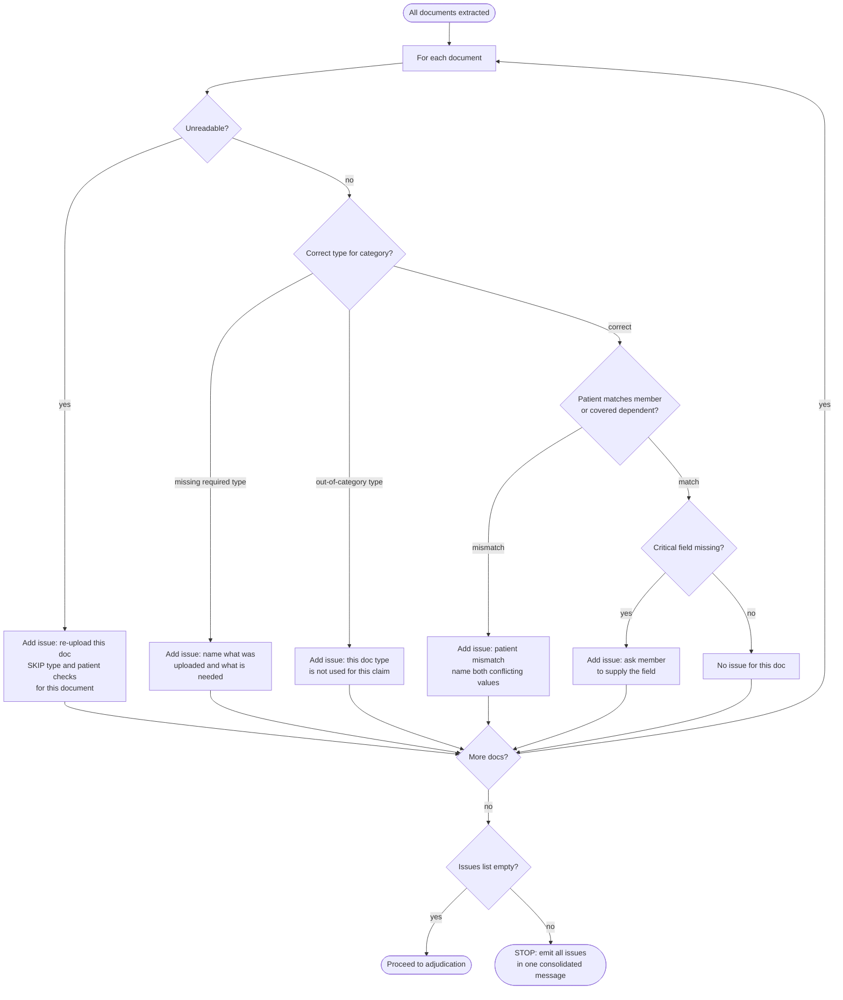
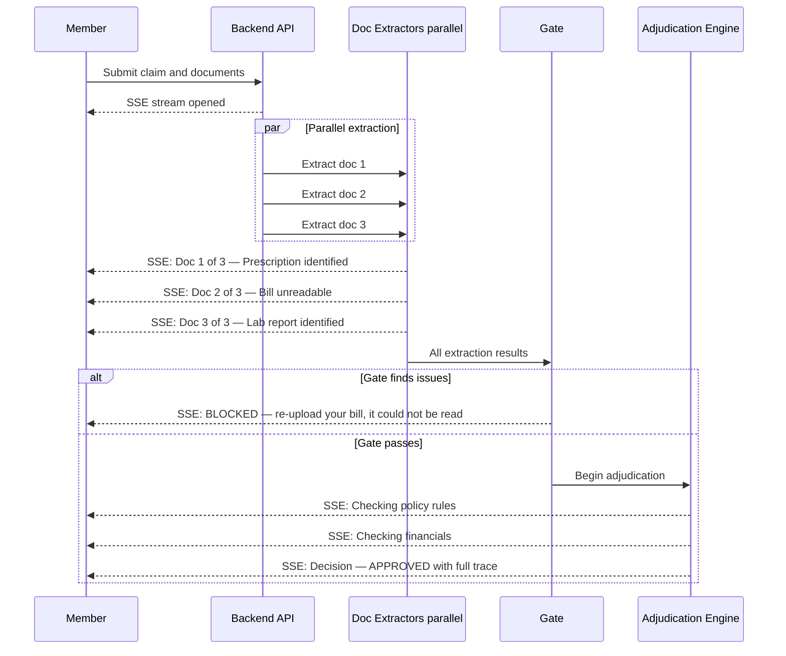
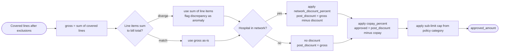
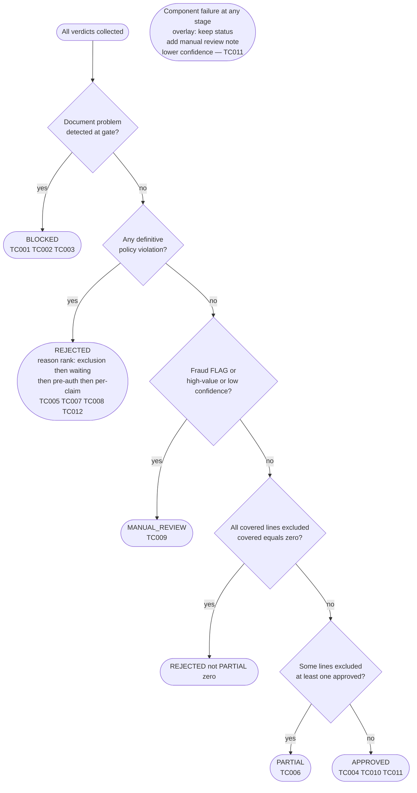
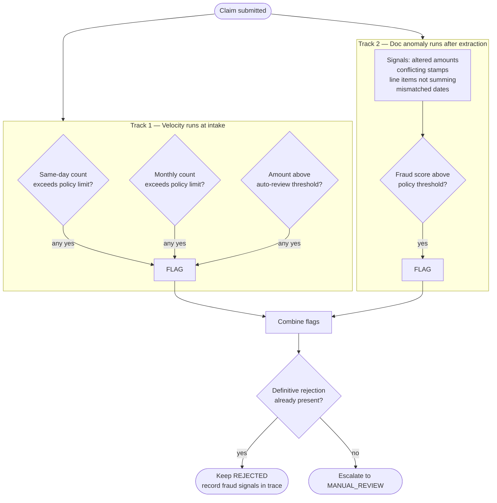
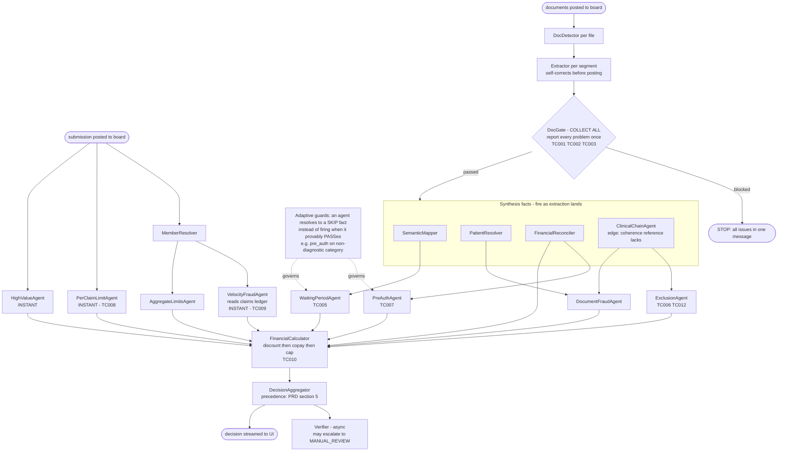
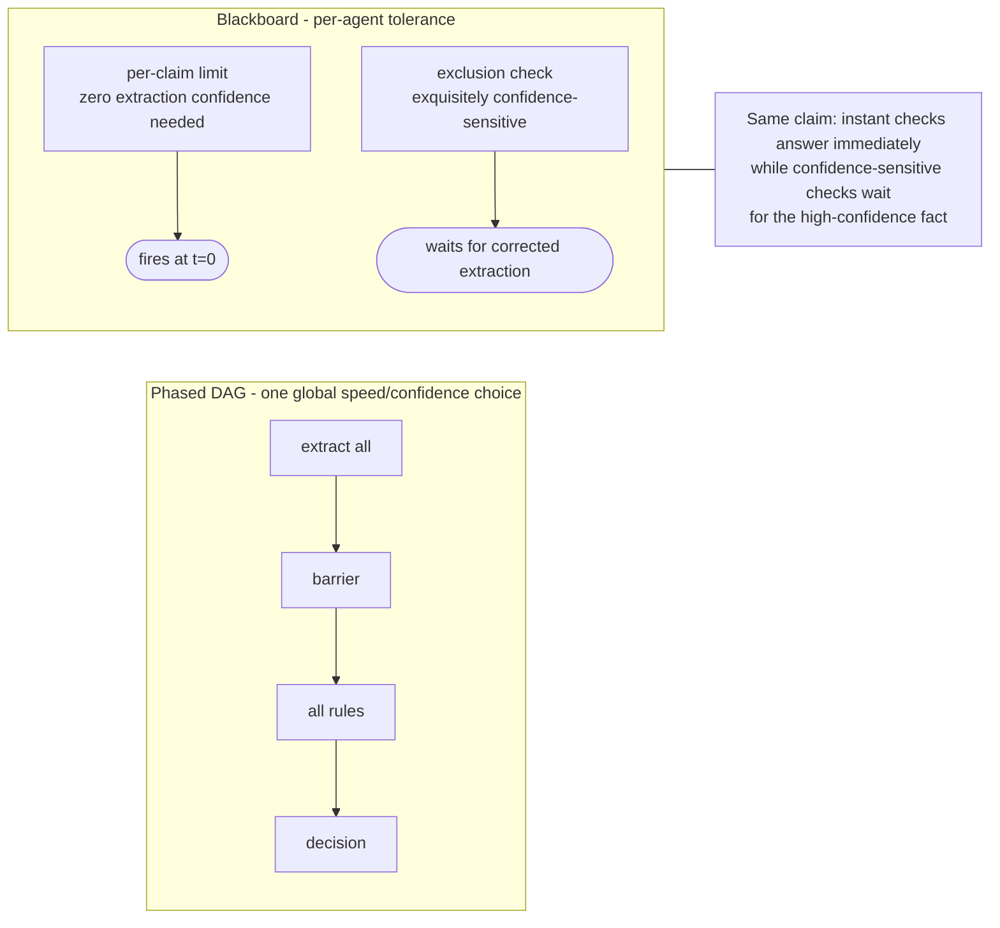

# System Diagrams

---

## 1. End-to-End Claim Processing Pipeline

---

## 2. Document Verification Gate — Collect-All Logic

---

## 3. Real-Time Member Experience — SSE Streaming

---

## 4. Financial Calculation — Order Is Load-Bearing

---

## 5. Decision Precedence

---

## 6. Fraud Detection — Two Tracks

---

## 7. Chosen Architecture — Multi-Agent Blackboard (B-static)

Agents fire the instant their input facts exist — no phases, no barriers. Instant-evidence verdicts land at t≈0; confidence-sensitive verdicts wait for the self-corrected extraction. Each agent fires at most once (B-static: no re-firing).

---

## 8. Why the Blackboard Beats a Phased DAG (speed + confidence at once)

