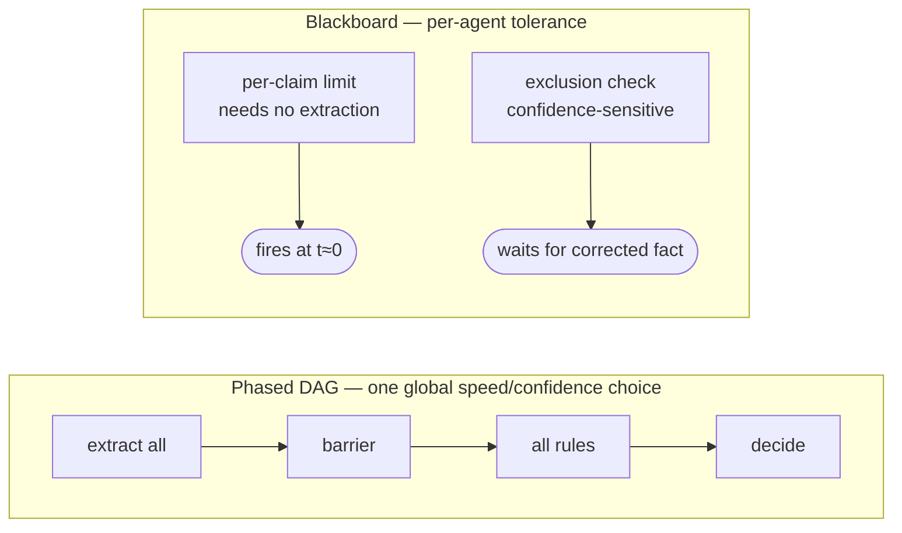
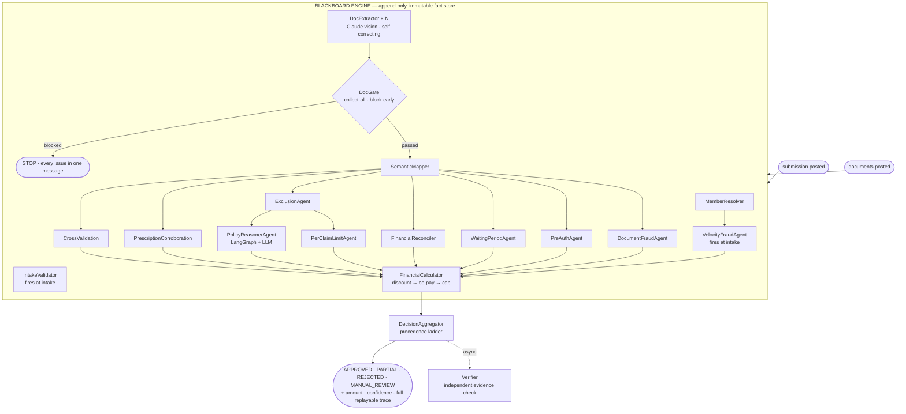
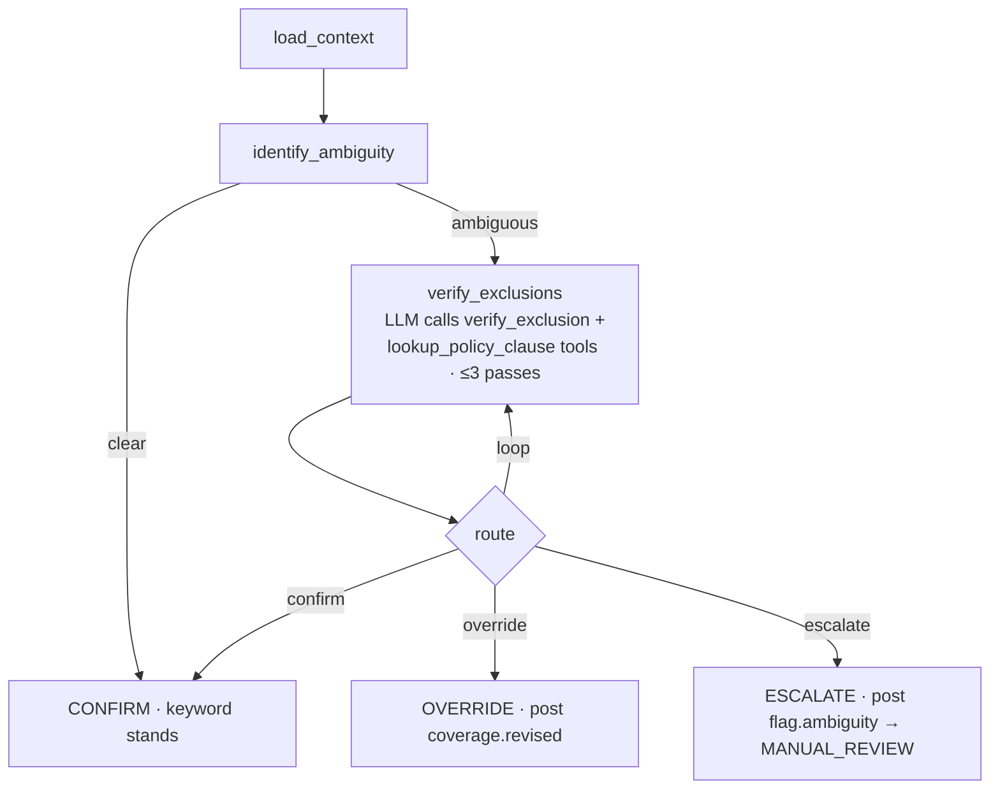
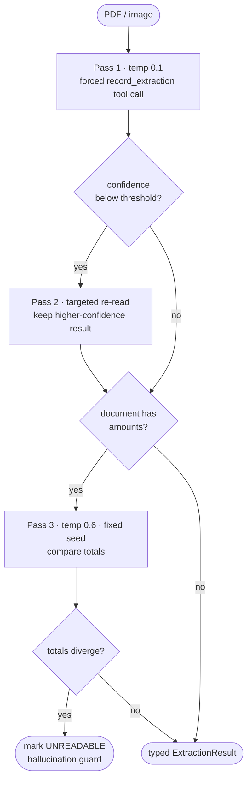
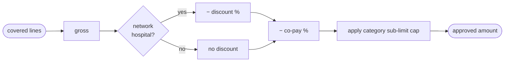
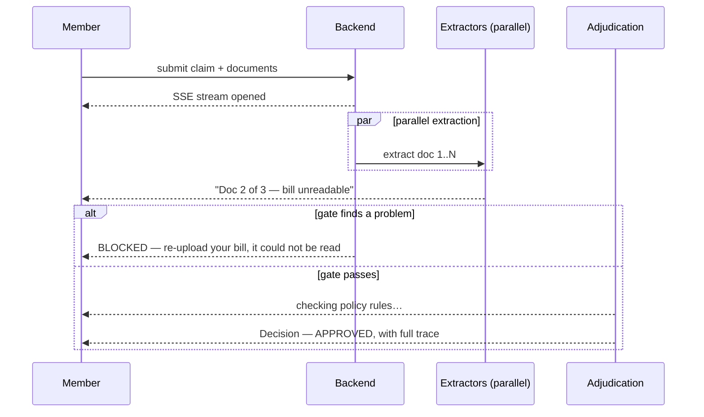
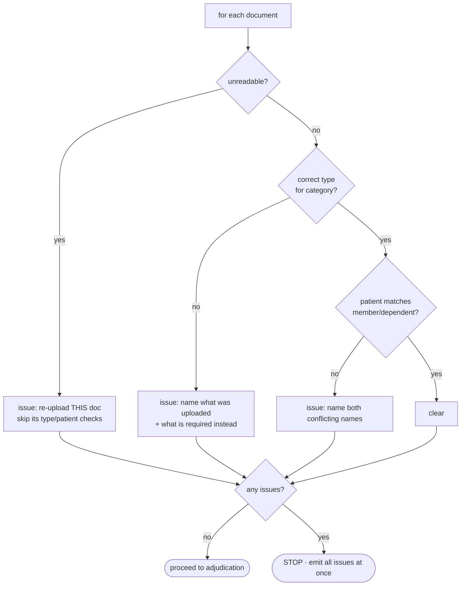

# Claims Adjudication

### AI-Native OPD Claims Adjudication Engine

*A multi-agent system that reads medical documents, reasons over policy, screens for fraud, and explains every decision — end to end, in seconds.*

<br/>

[](https://claims-d3b9z5cr2-soumyas-projects-2c6754d6.vercel.app)
[](https://claims-w2ze.onrender.com/health)
[](https://python.org)
[](https://nextjs.org)
[](https://anthropic.com)
[](https://langchain-ai.github.io/langgraph/)

</div>

---

## Overview

Adjudicating an OPD claim requires six judgments made together: *who is the member, are the documents valid, what does the policy say, does the math hold, is there a fraud signal, and how confident is the decision.* ClaimStream models each of those as an **independent agent on a shared blackboard**. Agents do not call one another — they read facts and write facts, and the scheduler fires each one the instant its inputs exist. Execution order is **derived from data dependencies, not wired by hand**. The result is fast, fully explainable, and degrades gracefully when any single component fails.

---

## Scope & Assumptions

The only inputs provided were the `assignment/` package — the specification, `policy_terms.json`, `test_cases.json`, and a guide *describing* Indian medical document formats. No sample document files were included, and the test cases describe scenarios in prose rather than supplying images. Everything below was built on that basis, and the following assumptions were made and documented along the way.

- **One corporate policy.** `policy_terms.json` is treated as a single employer policy applied to every member; no multi-policy or multi-tenant resolution. Per-tenant isolation is noted under *Path to 10×*.
- **OPD scope only.** Adjudication covers outpatient claims as specified; inpatient and cashless hospitalisation are out of scope.
- **Roster is authoritative.** Member identity, enrolment date, and dependents come from `policy_terms.json`. Supabase holds demo profiles and uploaded documents for the UI only — it is never a source of policy truth.
- **Date semantics.** Waiting periods are measured from the member's enrolment date to the claim's service date; velocity windows (same-day, monthly) are measured against the submission date.
- **Documents are synthesised from the guide.** With no sample files supplied, demo content was modelled on `sample_documents_guide.md` and the test-case descriptions. Real uploads go through live LLM extraction; demo profiles use inline content so the system runs offline.
- **Line-item adjudication.** Partial approval assumes bills can be itemised. When line items do not sum to the stated total, the line-item sum is used and the discrepancy is flagged as an anomaly.
- **Fraud detection is signal-based, not forensic.** Velocity and anomaly signals (totals not summing, mismatched names or dates) are used; pixel-level image-tamper forensics are out of scope. An injectable failure hook simulates a component fault for TC011.
- **Confidence cut-offs are calibrated heuristics.** The 0.95 base, 0.25 degradation penalty, and the `< 0.60 → MANUAL_REVIEW` threshold were tuned against the twelve test cases, not learned. Where a test case specifies an exact payout (TC004, TC006, TC010), that value was taken as ground truth for the financial waterfall.

---

## The Core Idea — a Blackboard, not a Pipeline

The conventional approach is a **DAG** or a single **LangGraph** spanning the whole flow. ClaimStream uses a blackboard instead, for one decisive reason.

A DAG fixes execution order explicitly — every new check means editing the graph. A *phased* DAG also forces **one global speed-vs-confidence choice** per claim: it waits at a barrier for *all* extraction to finish before *any* rule runs. But the checks do not need the same inputs:

- `PerClaimLimitAgent` needs **zero** document confidence — ₹7,500 > ₹5,000 is true the moment the claim arrives.
- `ExclusionAgent` is **confidence-sensitive** — it must wait for the self-corrected, high-confidence extraction or it rejects the wrong line.

A blackboard lets each agent set its **own** tolerance. Cheap, certain checks answer at `t≈0`; confidence-sensitive checks wait only for the fact they actually depend on. Same claim, two latencies, no shared barrier.



**Consequences of the design:** parallelism is implicit (no hand-written concurrency choreography), ordering follows each agent's declared `reads`, and adding an agent is a single class — it slots into the right place automatically because its data dependencies *are* its schedule.

---

## Architecture at a Glance



The scheduler core is ~50 lines and has no concept of a phase. On every tick it asks each pending agent whether it is `READY`, `WAIT`, or `SKIP`: ready agents fire concurrently as async tasks, skipped agents post a short-circuit fact with a reason, and each completed result is posted back to the board — which may unblock the next agents. Each agent declares only what it `reads` and `writes`; the dependency graph is never drawn by hand.

The engine is **B-static** — each agent fires *at most once*. Adjudication is a single-shot decision, so this keeps the trace linear and fully replayable: every fact carries a sequence number and a `derived_from` lineage, populated automatically from the agent's `reads`.

---

## Key Design Decisions

### 1. LangGraph used only where iterative reasoning earns its place

A blackboard is the wrong tool for the one genuinely fuzzy sub-problem: is a diagnosis truly excluded, or did a keyword merely match? A hit on "diabetes" may be a routine consultation, not a pre-existing-condition claim. That requires multi-step, tool-using, conditional reasoning — which is exactly what LangGraph provides.



The keyword verdict is posted **immediately** so the client sees a fast preliminary decision, while the StateGraph reasons in the background and either **confirms** it, **overrides** it (posting `coverage.revised` for downstream agents to use instead), or **escalates** to manual review after three passes. The heavier tool is scoped to exactly one node of the system.

### 2. Forced tool-use extraction, provider-agnostic, with a hallucination guard

Documents are messy — handwritten scripts, stamps over text, phone photos. Free-text LLM parsing degrades *silently*. The model is instead given a `record_extraction` tool it **must** call: it returns a valid typed object or nothing, and "nothing" becomes `UNREADABLE` — never a hallucinated number that flows into the payout math.



The LLM layer is an interface, not a vendor: **Claude Haiku 4.5** is primary, **Gemini 2.5 Flash** is a drop-in fallback, and a deterministic **FakeLLMClient** runs the entire test suite with zero API calls. A multi-document PDF (prescription + bill + lab report stitched together) is segmented in one pass, with continuation pages grouped into a single logical document.

### 3. Order is load-bearing in the financial waterfall

Test case TC010 encodes a real-world trap: the network discount must be applied *before* co-pay, not after — the two orders produce different payouts. The `FinancialCalculator` enforces one explicit sequence and records every step in the trace.



---

## Real-Time Member Experience — SSE Streaming

There is no blank spinner. `POST /claims` returns in milliseconds; the decision streams over **Server-Sent Events**, one event per fact, so the UI narrates extraction and adjudication live. Late or reconnecting clients receive every prior fact replayed first, and an optional Redis pub/sub path extends the stream across processes.



---

## Catching Document Problems Early

A generic error is not acceptable. The **DocGate** runs after extraction and is **collect-all** — it inspects every document, gathers *all* problems, and reports them in one consolidated message that names exactly what was uploaded and what is required instead.



This single agent covers three of the twelve test cases — wrong document, unreadable document, and mismatched patients — before any rule fires.

---

## Explainability & Graceful Degradation

**Every decision is reconstructable from its trace.** The operations team can read the fact log and see what each agent checked, what it concluded, and which facts fed the final call — `derived_from` makes the dependency chain explicit.

**Nothing crashes.** If an agent times out or a component is injected to fail, the scheduler drains it to a `skipped.*` fact marked `degraded`, the pipeline continues with whatever it has, and confidence drops to reflect the missing evidence. The decision then carries a note recommending manual review (TC011).

Confidence is computed from real signals, not heuristics (`aggregator.py`):

```
confidence = 0.95 × min(avg_extraction_quality, avg_rule_certainty)
           − 0.25 × (number of degraded components)
```

| Scenario | Confidence |
|---|---|
| Clean approval, all docs clear | ~0.95 |
| One low-quality document | ~0.75 |
| Component failure (graceful degradation) | ~0.70 |
| Multiple issues | < 0.60 → **MANUAL_REVIEW** |

---

## Agent Roster

Order is not declared — it emerges from each agent's `reads`. The grouping below reflects only *when* each agent becomes eligible.

| Agent | Reads | Writes | Responsibility |
|---|---|---|---|
| `MemberResolver` | submission | member | Resolve identity against the policy roster |
| `IntakeValidator` | submission | verdict.intake | Minimum-amount and field validation |
| `VelocityFraudAgent` | submission | verdict.fraud | Same-day / monthly frequency, high-value flag *(fires at intake)* |
| `DocExtractor` × N | submission | extraction.{id} | Claude vision extraction, one per document |
| `DocGate` | submission, member | gate | Collect-all document verification; blocks early |
| `SemanticMapper` | submission | semantic | Unify all extracted line items into one claim view |
| `CrossValidation` | semantic | verdict.consistency | Claim amount vs. bill total, date consistency |
| `PrescriptionCorroboration` | semantic | verdict.prescription | Prescription supports the diagnosed treatment |
| `ExclusionAgent` | semantic | coverage | Keyword exclusion check + line-item filtering |
| `FinancialReconciler` | semantic | financial_facts | Line-item sum vs. stated bill total |
| `WaitingPeriodAgent` | submission, member | verdict.waiting | Condition-specific waiting periods |
| `PreAuthAgent` | submission | verdict.preauth | Pre-authorisation enforcement |
| `DocumentFraudAgent` | semantic | verdict.docfraud | Anomaly signals; injectable failure hook |
| `PerClaimLimitAgent` | coverage | verdict.perclaim | Per-claim ceiling vs. category sub-limit |
| `PolicyReasonerAgent` | coverage | policy_reasoning | LangGraph reasoning over the exclusion verdict |
| `FinancialCalculator` | coverage, financial_facts | financial_breakdown | Final payout waterfall |

Agents that can prove they are unneeded resolve to a `SKIP` fact (for example, pre-auth on a non-diagnostic category). They appear in the trace as *short-circuited*, never silently absent — the audit log is always complete.

---

## Eval — 12 / 12, Zero API Calls

The full assignment suite runs against a deterministic `FakeLLMClient`, so the eval is reproducible and free. `pytest tests/eval/` enforces a floor of twelve green.

| TC | Scenario | Expected | What it proves |
|---|---|---|---|
| 001 | Wrong document uploaded | **BLOCKED** | DocGate early, specific rejection |
| 002 | Unreadable document | **BLOCKED** | LLM quality guard |
| 003 | Documents from different patients | **BLOCKED** | Cross-patient detection |
| 004 | Clean consultation | **APPROVED** | Happy path + co-pay waterfall |
| 005 | Diabetes within waiting period | **REJECTED** | Member join-date check |
| 006 | Dental with cosmetic line | **PARTIAL** | Line-item exclusion + partial approval |
| 007 | MRI without pre-auth | **REJECTED** | Pre-auth enforcement |
| 008 | Per-claim limit exceeded | **REJECTED** | Financial cap |
| 009 | Many same-day claims | **MANUAL_REVIEW** | Velocity fraud signal |
| 010 | Network hospital discount | **APPROVED** | Discount-before-co-pay order |
| 011 | Component failure mid-run | **APPROVED** | Graceful degradation + lowered confidence |
| 012 | Bariatric (excluded) | **REJECTED** | Policy exclusion |

Supporting suites: `test_scheduler`, `test_doc_gate`, `test_financial`, `test_aggregator`, `test_cross_validation`, `test_prescription_check`, `test_policy`, `test_llm`, `test_api`, `test_part6`.

---

## Policy Configuration

Every rule lives in `assignment/policy_terms.json`. No policy logic is hardcoded — agents read thresholds, limits, and exclusions at runtime.

```
Sum insured / employee   ₹5,00,000      Same-day claim limit   2
Annual OPD limit         ₹50,000        Monthly claim limit    6
Per-claim limit          ₹5,000         Auto-review above      ₹25,000
Family floater           ₹1,50,000      Fraud-score review     0.80

Categories   consultation · diagnostic · pharmacy · dental · vision · alternative
Network      Apollo · Fortis · Max · Manipal · Narayana · Medanta · Kokilaben · Aster …
```

---

## Tech Stack

```
Frontend     Next.js 14 (App Router) · TypeScript · Supabase JS · SSE
Backend      FastAPI · Python 3.12 · asyncio · uv
Engine       Custom B-static blackboard scheduler (~50-line core)
AI / LLM     Claude Haiku 4.5 (primary) · Gemini 2.5 Flash (fallback) · Fake (offline/tests)
             Forced tool-use extraction · LangGraph StateGraph policy reasoning
Data         Supabase (Postgres) roster + documents · optional Redis for cross-process SSE
Deploy       Vercel (frontend) · Render (backend)
```

---

## Local Setup

**Prerequisites:** Python 3.12+, Node 18+, [`uv`](https://docs.astral.sh/uv/)

```bash
git clone https://github.com/S-hub18/claims.git && cd claims

# Backend
cd backend
cp .env.example .env          # add ANTHROPIC_API_KEY (or GEMINI_API_KEY)
uv sync
uv run uvicorn app.api.main:app --reload --port 8000

# Frontend (new terminal)
cd frontend
cp .env.example .env.local    # Supabase keys + NEXT_PUBLIC_API_URL=http://localhost:8000
npm install && npm run dev
```

Open [http://localhost:3000](http://localhost:3000).

> **No API key?** The engine runs in offline mode — demo profiles adjudicate correctly from inline content, and the full eval passes. Only real PDF uploads need a live key.

Run the suite: `cd backend && uv run pytest` · Run only the eval: `uv run pytest tests/eval/`

---

## Deploy

| | Backend | Frontend |
|---|---|---|
| **Platform** | Render (free) | Vercel (free) |
| **Config** | `render.yaml` at repo root | root dir → `frontend/` |
| **Key env** | `ANTHROPIC_API_KEY`, `FRONTEND_URL` | `NEXT_PUBLIC_API_URL` |

> Render's free tier sleeps after 15 minutes. Call `/health` once before a demo to wake it (~30s cold start).

---

## Limitations & the Path to 10×

A clear separation between current demo shortcuts and what the design already anticipates:

| Today | At 10× load |
|---|---|
| In-memory claim store (per-process) | Redis + Postgres persistence — `ClaimStore` already accepts both |
| Single uvicorn worker | Horizontal workers behind a Redis-backed store and SSE bus |
| Velocity ledger per-process | Redis `INCR` with TTL — atomic, cross-process |
| Multi-doc PDF uses one-pass segmentation | `pypdf` split + a guarded `extract()` per segment |
| No API auth | JWT middleware + per-tenant policy isolation |

These are configuration changes rather than rewrites: state location and worker count are orthogonal to the agent contracts.

---


Built for the Plum AI Engineer Assignment

