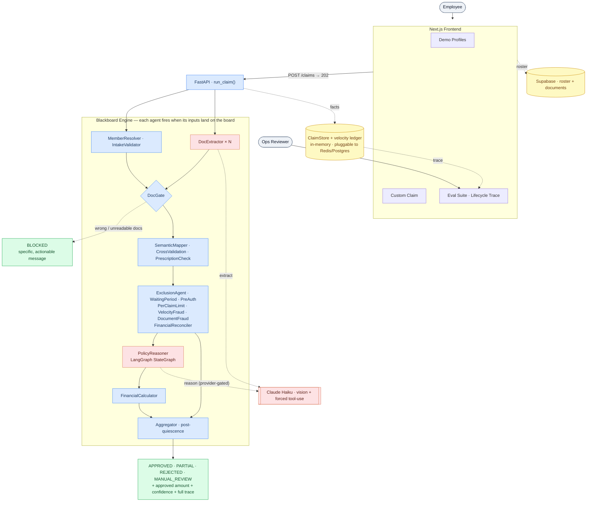
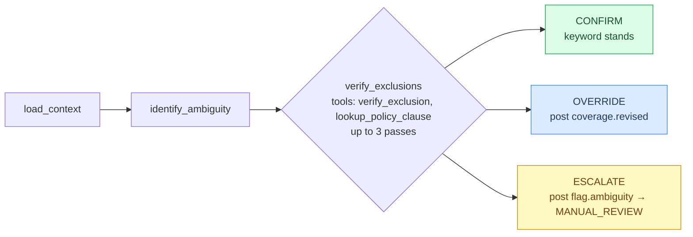

<div align="center">

# ClaimStream

**AI-native adjudication for health-insurance OPD claims.**

A multi-agent system that reads medical documents, reasons over policy, screens for fraud, and produces an explainable decision — `APPROVED`, `PARTIAL`, `REJECTED`, or `MANUAL_REVIEW` — with a complete, replayable trace of every step.

> **Design principle: LLMs read and propose. Deterministic code decides.**
> Vision models extract facts and reason over ambiguity; the money decision is made by auditable, testable Python rules — never by a model.

<br/>

[](https://claims-d3b9z5cr2-soumyas-projects-2c6754d6.vercel.app)
[](https://claims-w2ze.onrender.com/health)
[](https://python.org)
[](https://fastapi.tiangolo.com)
[](https://langchain-ai.github.io/langgraph/)
[](https://anthropic.com)
[](https://nextjs.org)
[](https://supabase.com)

</div>

---

## Contents

- [The Product](#the-product) — what an operator and a member actually get
- [Architecture](#architecture) — the diagram and the two engines
- [How a Claim Flows](#how-a-claim-flows) — wave by wave
- [Document Understanding](#document-understanding) — Claude vision + hallucination guards
- [Policy Reasoning](#policy-reasoning-langgraph) — the LangGraph layer
- [Explainability & Confidence](#explainability--confidence)
- [Failure Handling](#failure-handling)
- [Eval — 12 Test Cases](#eval--12-test-cases)
- [Tech Stack](#tech-stack)
- [Configuration](#configuration)
- [Run Locally](#run-locally)
- [Deploy](#deploy)
- [Project Structure](#project-structure)
- [Design Decisions & Trade-offs](#design-decisions--trade-offs)
- [Limitations & Scale](#limitations--scale)

---

## The Product

A claim is messy and high-stakes: a member uploads phone photos of a prescription and a hospital bill; an operator must decide, defensibly, how much to pay. ClaimStream serves both sides.

**For the member**
- Upload PDFs or images of any of the standard documents — prescriptions, hospital bills, lab reports, discharge summaries.
- If the wrong document is uploaded, the system stops *before* processing and says exactly what's missing and what to attach instead — not a generic error.
- A single combined PDF (prescription + bill + lab report stitched together) is split automatically.

**For the operator**
- Every decision opens into a full trace: what each agent checked, what passed, what failed, and why the final decision was reached.
- A confidence score derived from real signals — extraction quality and rule certainty — drops visibly when something degrades.
- A live lifecycle view shows the agent graph executing in parallel waves, with per-step timing.

The deployed app exposes three views: **Demo Profiles** (10 seeded scenarios from the policy roster), **Custom Claim** (build a claim from scratch, upload real files, edit the policy inline, trigger fraud or a component failure), and the **Eval Suite** (the lifecycle inspector with graph and timeline traces).

---

## Architecture

Two engines, each chosen for the problem it fits. A **blackboard scheduler** runs the overall adjudication — agents fire the instant their inputs exist, so parallelism is automatic. A **LangGraph StateGraph** handles the one sub-problem that needs iterative, branching reasoning: deciding whether a diagnosis is genuinely excluded.



**Legend** — 🟥 LLM (proposes) · 🟦 deterministic Python (decides) · 🟨 infrastructure · 🟩 outcome

### Why a blackboard for the outer loop

The blackboard is an append-only, immutable **fact store**. Agents never call each other; they declare the fact keys they `read` and the key they `write`. The scheduler fires every agent whose reads are satisfied — concurrently — and posts each result the instant it lands, which can immediately unblock the next wave.

```python
class WaitingPeriodAgent(GateGatedAgent):
    reads  = ["submission", "member"]
    writes = "verdict.waiting"

    async def _run(self, bb: Blackboard) -> Fact:
        ...
        return Fact(key=self.writes, value={"status": "REJECTED", ...},
                    author=self.name, confidence=1.0)
```

The scheduler is ~50 lines. No phases, no barriers, no orchestrator:

```
while pending or running:
    for agent in pending:
        match agent.ready(blackboard):   # tri-state
            READY → launch as asyncio.Task        # runs in parallel
            SKIP  → post skipped.{name} + prune    # provably unneeded
            WAIT  → leave for a later wave
    await first task to complete
    post its fact → may make new agents READY
```

Add a new check and you write one class with its `reads`/`writes` — it slots into the correct wave automatically. **B-static** (each agent fires at most once) keeps the run a single-shot decision and the trace linear: every fact carries a sequence number and a `derived_from` lineage, so any decision reconstructs exactly from the log.

---

## How a Claim Flows

| Wave | Agents (run in parallel) | What happens |
|------|--------------------------|--------------|
| **1** | MemberResolver · IntakeValidator · DocExtractor × N | Resolve the member, validate fields, and read every uploaded document with Claude — all at once |
| **2** | DocGate | Confirm the right document *types* are present. Wrong/unreadable → **BLOCKED** here, before any money logic runs |
| **3** | SemanticMapper · CrossValidation · PrescriptionCheck | Unify extracted fields; verify the documents describe the *same patient* and the prescription backs the treatment |
| **4** | ExclusionAgent · WaitingPeriod · PreAuth · PerClaimLimit · VelocityFraud · DocumentFraud · FinancialReconciler | Every policy and fraud check fires in parallel against the unified claim |
| **5** | PolicyReasoner (LangGraph) · FinancialCalculator | Reason over ambiguous exclusions; compute the final payout waterfall |
| **—** | Aggregator | After the board goes quiescent, reduce the full fact-set to one decision with a reason precedence ladder |

---

## Document Understanding

Extraction uses **Claude Haiku** with **forced tool-use** — the model is handed a `record_extraction` tool and *must* call it. There is no free-text to parse: the model returns a valid structured object or nothing, and "nothing" is treated as `UNREADABLE`, never invented.

Three guards protect against hallucination on a financial document:

1. **Low-confidence re-read** — below a confidence threshold, a second targeted pass re-reads patient name, date, and total; the more confident result wins.
2. **Self-consistency on amounts** — any money-bearing document is re-extracted at a higher temperature. If the two passes disagree on totals, the document is marked `UNREADABLE` rather than trusting a number that drifted.
3. **Combined-PDF splitting** — one PDF holding several documents is segmented in a single pass via a `record_documents` tool call; continuation pages (a multi-page bill) are grouped into one logical document.

The extraction provider is pluggable behind a common interface (`AnthropicClient`, `GeminiClient`, and a `FakeLLM` for deterministic tests).

---

## Policy Reasoning (LangGraph)

Keyword matching alone is brittle: "diabetes" might be a routine consultation or a pre-existing-condition claim. The `PolicyReasonerAgent` wraps a **LangGraph `StateGraph`** that re-examines the keyword exclusion verdict with tool-calling and bounded iteration.



- **CONFIRM** → the keyword verdict stands.
- **OVERRIDE** → the model found the keyword was wrong; it posts `coverage.revised`, which downstream agents consume instead.
- **ESCALATE** → still ambiguous after three passes → `flag.ambiguity` → `MANUAL_REVIEW`.

A fast keyword answer is posted first (~0.6s) so the client sees a preliminary decision while the graph reasons; intermediate `policy_reasoning.step` facts stream over SSE.

> **Honest scope:** the reasoning loop engages with a reasoning-capable provider (Gemini). The deployed demo runs **Claude for vision extraction** and keeps the reasoner in its deterministic keyword baseline so the 12 graded cases are exactly reproducible — wiring a reasoning LLM is a one-line provider switch, not a rebuild. This is the design principle in action: the model is allowed to *propose*, but a graded run never depends on it.

---

## Explainability & Confidence

Nothing is a black box. The blackboard *is* the audit log — `GET /claims/{id}` returns the entire ordered fact list, and the Eval Suite replays it as either a fork-join graph (parallel waves) or a timeline (per-step timing and verdicts).

Confidence is computed from real signals, not asserted:

```
confidence = 0.95 × min(avg_extraction_quality, avg_rule_certainty)
           − 0.25 × (number of degraded components)
```

| Situation | Confidence |
|-----------|-----------|
| Clean approval, clear documents | ~0.95 |
| A low-quality document | ~0.75 |
| A component failed mid-run | ~0.70 |
| Multiple issues | < 0.60 → `MANUAL_REVIEW` |

---

## Failure Handling

Components fail — LLM timeouts, parse errors, bad inputs. The engine never crashes:

- An agent that raises is caught; a **degraded** fact is posted in its place and the run continues.
- The wall-clock deadline drains any stragglers as degraded facts rather than hanging.
- Each degraded component lowers confidence, and the aggregator routes a sufficiently degraded claim to `MANUAL_REVIEW`.
- The API exception handler guarantees a JSON envelope — never a raw 5xx — to the client.

The Custom Claim view has a **Simulate component failure** toggle that crashes the `DocumentFraudAgent` mid-run on demand: the claim still decides, confidence drops, and a manual-review note appears.

---

## Eval — 12 Test Cases

All twelve cases from `assignment/test_cases.json` run through the live engine.

| ID | Scenario | Expected | Exercises |
|----|----------|----------|-----------|
| TC001 | Wrong document uploaded | BLOCKED | DocGate early rejection |
| TC002 | Unreadable document | BLOCKED | LLM quality guard |
| TC003 | Documents from different patients | BLOCKED | CrossValidation |
| TC004 | Clean consultation | APPROVED | Full waterfall, happy path |
| TC005 | Waiting period — diabetes | REJECTED | Member join-date enforcement |
| TC006 | Dental, cosmetic portion excluded | PARTIAL | Exclusion + partial approval |
| TC007 | MRI without pre-authorisation | REJECTED | PreAuth enforcement |
| TC008 | Per-claim limit exceeded | REJECTED | Financial cap |
| TC009 | Multiple same-day claims | MANUAL_REVIEW | Velocity fraud |
| TC010 | Network hospital | APPROVED | Network discount applied |
| TC011 | Component failure mid-run | APPROVED | Graceful degradation |
| TC012 | Excluded treatment (bariatric) | REJECTED | Policy exclusion + reason precedence |

```bash
cd backend && uv run pytest tests/eval        # run the eval suite
cd backend && uv run pytest                    # full unit + integration suite
```

---

## Tech Stack

| Layer | Choice |
|-------|--------|
| Frontend | Next.js 14 (App Router), TypeScript, Supabase JS |
| Backend | FastAPI, Python 3.12, asyncio, `uv` |
| Agent engine | Custom B-static blackboard scheduler (`app/blackboard`) |
| Reasoning | LangGraph `StateGraph` (`app/agents/policy_reasoner.py`) |
| Vision / LLM | Anthropic Claude Haiku (Gemini supported, FakeLLM for tests) |
| Data | Supabase (Postgres) — employee roster + documents |
| Deploy | Vercel (frontend) · Render (backend) |

---

## Configuration

All policy rules are read from `assignment/policy_terms.json` at startup — no hardcoded limits.

| Variable | Required | Where | Purpose |
|----------|----------|-------|---------|
| `ANTHROPIC_API_KEY` | for real uploads | Backend | Claude vision extraction |
| `FRONTEND_URL` | for deploy | Backend | CORS allow-list (your Vercel URL) |
| `GEMINI_API_KEY` | optional | Backend | Enables the LangGraph reasoning loop |
| `DATABASE_URL` | optional | Backend | Postgres persistence (else in-memory) |
| `REDIS_URL` | optional | Backend | SSE pub/sub across processes |
| `NEXT_PUBLIC_API_URL` | yes | Frontend | Backend base URL |
| `NEXT_PUBLIC_SUPABASE_URL` | yes | Frontend | Supabase project URL |
| `NEXT_PUBLIC_SUPABASE_ANON_KEY` | yes | Frontend | Supabase anon key |

Key policy values: sum insured ₹5,00,000 · annual OPD ₹50,000 · per-claim ₹5,000 · auto-review above ₹25,000 · same-day fraud limit 2 · monthly limit 6.

---

## Run Locally

**Prerequisites:** Python 3.12+, Node 18+, [`uv`](https://docs.astral.sh/uv/)

```bash
git clone https://github.com/S-hub18/claims.git && cd claims

# Backend
cd backend
cp .env.example .env          # add ANTHROPIC_API_KEY
uv sync
uv run uvicorn app.api.main:app --reload --port 8000

# Frontend (new terminal)
cd frontend
cp .env.example .env.local    # Supabase keys + NEXT_PUBLIC_API_URL=http://localhost:8000
npm install && npm run dev
```

Open **http://localhost:3000**.

> Without `ANTHROPIC_API_KEY` the engine runs offline — all 10 demo profiles adjudicate correctly from inline content; only real PDF uploads skip LLM extraction.

---

## Deploy

| | Backend | Frontend |
|---|---------|----------|
| Platform | Render (free) | Vercel (free) |
| Config | `render.yaml` at repo root | root directory → `frontend/` |
| Build | `pip install uv && uv sync --frozen` | default |
| Start | `uv run uvicorn app.api.main:app --host 0.0.0.0 --port $PORT` | default |

Set `FRONTEND_URL` (Render) to your Vercel URL and `NEXT_PUBLIC_API_URL` (Vercel) to your Render URL. Render's free tier sleeps after 15 min — hit `/health` once before a demo (~30s cold start).

---

## Project Structure

```
backend/app/
├── blackboard/        # core.py (Fact, Blackboard, Agent) + scheduler.py (~50 lines)
├── agents/            # 14 agents — each declares reads/writes
│   ├── policy_reasoner.py   # LangGraph StateGraph
│   ├── extractor.py         # per-document Claude extraction
│   ├── financial.py · rules.py · exclusion.py · fraud.py · ...
├── llm/               # anthropic_client.py · gemini.py · fake.py · base.py
├── policy/            # loader.py — reads policy_terms.json, no hardcoding
├── aggregator.py      # post-quiescence fact-set → Decision (reason precedence)
├── engine.py          # build_agents() + run_claim()
└── api/               # main.py (FastAPI) · routes · schemas · store
backend/tests/         # 11 unit/integration suites + eval/ runner
frontend/
├── app/               # Next.js App Router
├── components/        # DemoView · CustomView · EvalView · ResultPanel · ...
└── lib/               # api.ts · engine.ts · policy.ts · supabase.ts · types.ts
```

---

## Design Decisions & Trade-offs

**Blackboard for the outer loop; LangGraph for the reasoning sub-problem.** A DAG or a single LangGraph pipeline forces you to wire execution order by hand. The blackboard derives order from data dependencies — new agent, declare its reads, done — and parallelism falls out for free. LangGraph earns its place exactly where iterative tool-calling and conditional branches matter: exclusion reasoning. Using it for the whole engine would be the wrong tool.

**Forced tool-use over prompt-engineered extraction.** Free-text output is fragile and degrades silently. A forced tool call yields a typed object or an honest `UNREADABLE` — a failure that's visible, not a hallucinated total that flows into a payout.

**The LLM proposes; deterministic code decides.** Extraction and reasoning are model work; the money decision is plain Python with unit tests. A graded run is reproducible because nothing financial depends on a sampled token.

**In-memory state for the demo, pluggable for production.** `ClaimStore` already accepts a Redis client and a DB session factory; the velocity ledger is keyed by `(client_session, member_id)` so concurrent evaluators stay isolated. Moving to distributed state is configuration, not a rewrite.

---

## Limitations & Scale

| Current | At 10× load |
|---------|-------------|
| In-memory claim store (per-process) | Redis pub/sub + Postgres persistence (interfaces already present) |
| Single uvicorn worker | Multiple workers behind a load balancer; shared store |
| Velocity ledger is per-process | Redis `INCR` with TTL — atomic, cross-process counts |
| Multi-doc PDF uses one-pass extraction | pypdf page split + guarded `extract()` per segment |
| No API authentication | JWT middleware, per-tenant policy isolation |
